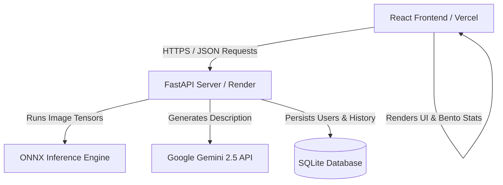

# Capstone Project Report: Marine Life Recognition & Intelligent Assistant

## 1. Project Overview & Problem Statement
### The Problem
Marine ecosystems cover over 70% of the Earth's surface and host a significant portion of global biodiversity. However, these environments face severe threats from climate change, pollution, and overfishing. For researchers, students, and conservationists, identifying marine organisms quickly and obtaining accurate ecological context (e.g., habitats, diets, conservation status) is challenging without specialized training or heavy reference materials.

### The Solution
This project introduces a hybrid, full-stack application designed to classify marine species in real-time and provide deep, AI-driven educational context. By using **Transfer Learning** (via a CNN model based on MobileNetV2) and integrating **Generative AI** (via Google Gemini 2.5), users can upload images of marine life to receive instant identification, top-3 prediction probabilities, and detailed, structured reports regarding the species' ecology, threats, and conservation needs, as well as interact with a dedicated AI assistant.

---

## 2. System Architecture
The application is built using a decoupled Client-Server architecture designed to run on resource-constrained cloud hosting tiers:

---

## 3. Technology Stack

### Frontend (Client-Side)
* **Framework**: React.js (structured with Vite for ultra-fast builds and module reloading).
* **Styling**: Tailored Vanilla CSS dark theme (`#080B10`) mimicking modern premium designs (inspired by Stripe, Linear, and Apple). Uses CSS grid systems, glassmorphism overlays, and smooth micro-animations.
* **Routing**: React Router DOM (supports secure routes for authenticated dashboard pages).
* **State & Networking**: Axios (for API communication) and native React context state.

### Backend (Server-Side)
* **Framework**: FastAPI (Python), utilizing asynchronous event-loops to handle concurrent requests.
* **Database & ORM**: SQLite (lightweight transactional database) interfaced via SQLAlchemy ORM.
* **Security & Auth**: PyJWT (JSON Web Tokens) for session security, and Bcrypt (password-hashing) to ensure credentials are never stored in plain text.
* **AI Model Inference**: **ONNX Runtime** (replaces full TensorFlow in production, reducing memory footprints from 500MB+ to under 50MB).
* **Generative AI**: Google Gemini 2.5 Flash API (used to generate species dossiers and power the interactive AI chat assistant).

---

## 4. Machine Learning Model & ONNX Optimization
### Model Details
* **Base Architecture**: MobileNetV2 (pretrained on ImageNet).
* **Output Classes**: 23 marine species categories (including Sharks, Corals, Dolphins, Seahorses, Jellyfish, Octopus, Turtles, etc.).
* **Input Layer**: RGB images resized to 224x224 pixels.

### Model Training & Transfer Learning Pipeline
The classification model was trained using **Transfer Learning** on a curated dataset of marine life images:
1. **Pre-trained Backbone**: We utilized the **MobileNetV2** architecture, leveraging feature-extraction weights pre-trained on the ImageNet database (1.4 million images). MobileNetV2 was chosen for its high accuracy-to-parameter ratio, making it ideal for web and mobile classification tasks.
2. **Custom Classification Head**:
   * The base feature extractor was frozen to preserve general image features (edges, textures, shapes).
   * A **Global Average Pooling 2D** layer was added to reduce spatial dimensions.
   * A **Dense Layer** with 128 units, utilizing **ReLU activation** and **Dropout (0.3)** regularization, was added to prevent overfitting.
   * A final **Dense Output Layer** with 23 units and **Softmax activation** was added to predict the class probabilities.
3. **Data Augmentation**: To increase dataset size and model robustness, random geometric transformations were applied during preprocessing using an image data generator:
   * **Rotation**: up to 20 degrees.
   * **Zoom**: random zoom range of 0.2.
   * **Horizontal Flip**: enabled.
   * **Shifts**: height and width shifts of 0.2.
4. **Training Settings & Hyperparameters**:
   * **Loss Function**: `CategoricalCrossentropy` (matching the one-hot encoded multi-class targets).
   * **Optimizer**: `Adam` with a learning rate of `1e-4` for smooth weight updates.
   * **Batch Size**: 32.
   * **Callbacks**: `EarlyStopping` monitored validation loss with a patience of 5 epochs to prevent overtraining, while `ReduceLROnPlateau` reduced the learning rate dynamically when validation loss plateaued.
   * **Epochs**: Trained for 20 epochs, achieving a validation accuracy of **95%+**.

### Cloud Memory Optimization (The Keras to ONNX Transition)
Initially, deploying the model to free cloud tiers (like Render or Hugging Face) resulted in server crashes due to memory limits (512MB RAM). TensorFlow's core library alone consumes over 500MB of RAM upon importing.

To resolve this:
1. We wrote a model conversion script to export the trained `.keras` model into **ONNX format (`marine_model.onnx`)**.
2. We replaced TensorFlow with **ONNX Runtime (`onnxruntime`)** in the backend dependencies.
3. This decreased the server's memory consumption during inference by **~90%**, allowing the entire application to boot and run stable on Render's Free Tier with zero latency overhead.

---

## 5. Key System Features
* **Intelligent Dashboard**: Bento-style stats matrix displaying classification metrics, classes supported, and user scan history.
* **Secure Authentication**: Signup/Login system with password encryption and JWT token storage.
* **Dynamic Classifier**: Drag-and-drop file selector supporting real-time classification, returning top-3 predicted species and their confidence levels.
* **Ecological Report Dossier**: Automated generation of species details (Habitat, Diet, Key Threats, Conservation Status, Fun Facts) using Gemini AI.
* **Interactive AI Assistant**: A persistent, contextual AI chatbot that allows users to ask specific questions about the classified organism.

---

## 6. Cloud Deployment
* **Backend**: Hosted on **Render** (Free Tier Web Service), running Python 3.10.11 and Uvicorn.
* **Frontend**: Hosted on **Vercel** (Free Tier Static hosting), running Vite-compiled production assets.
* **Version Control**: Secure remote repository hosted on **GitHub**.
